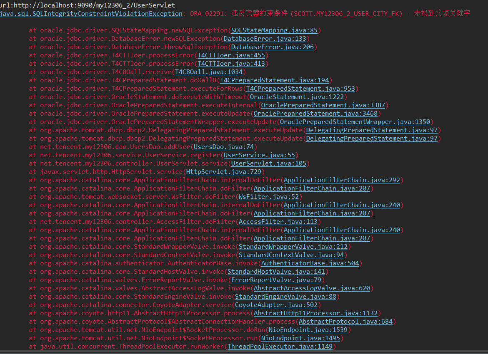
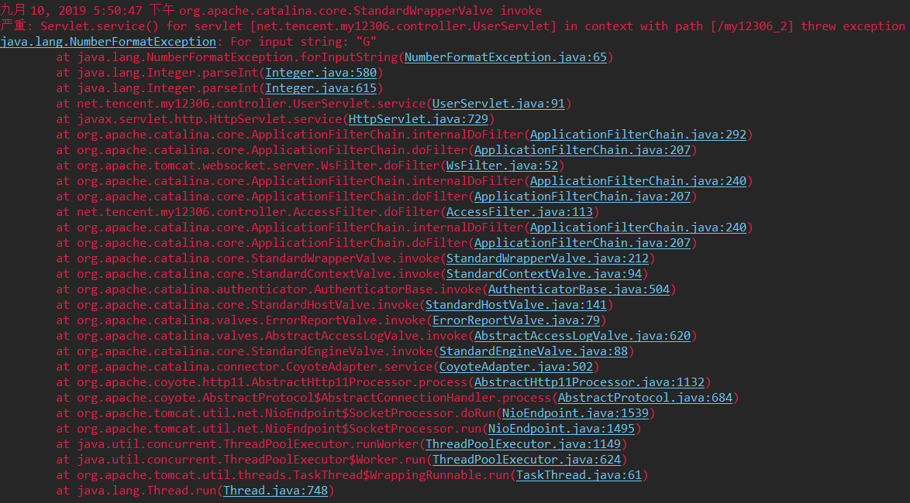
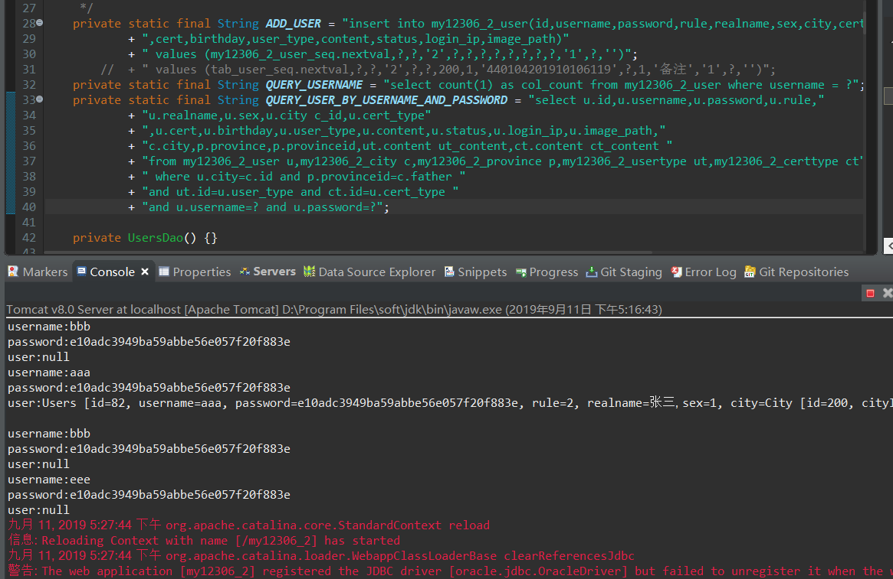
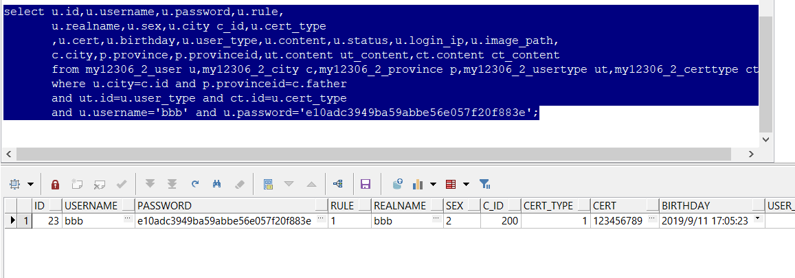

# 仿12306网站

```
所用技术知识点：

1. 访问控制过滤器Filter的使用

2. 


1. 验证码

2. 

```


#### 项目所遇部分bug总结

1. ORA-02291: 违反完整约束条件 (SCOTT.MY12306_2_USER_CITY_FK) - 未找到父项关键字



原因:赋值错误 ：赋值city时关联的是id不是cityid

解决: 取得City实体内的id值正确赋值即可

[参考链接](https://blog.csdn.net/jihuanliang/article/details/7205968)

2. bug For input string: "" (其中双引号内可能为C也可能为G等任何字母)



原因：前端JSP页面value里的值为C或G或者任何字母,不能转换成数值。

解决：将前端JSP页面中的value里的值更改为数字类型的字符串即可

3. 数据库能根据用户名密码能够查到而页面却不能登陆





完全是因为自己事务没有学好，特么小废物不知道插入数据之后提交造成的。。。。

4. 跳转jsp页面url后带中文出现乱码

解决：两行Java代码

```
String mes = URLEncoder.encode("注册成功","utf-8");//加码
response.sendRedirect(request.getContextPath() + "/login.jsp?message=" + mes);

String message = URLDecoder.decode(request.getParameter("message"), "utf-8");//解码
```

