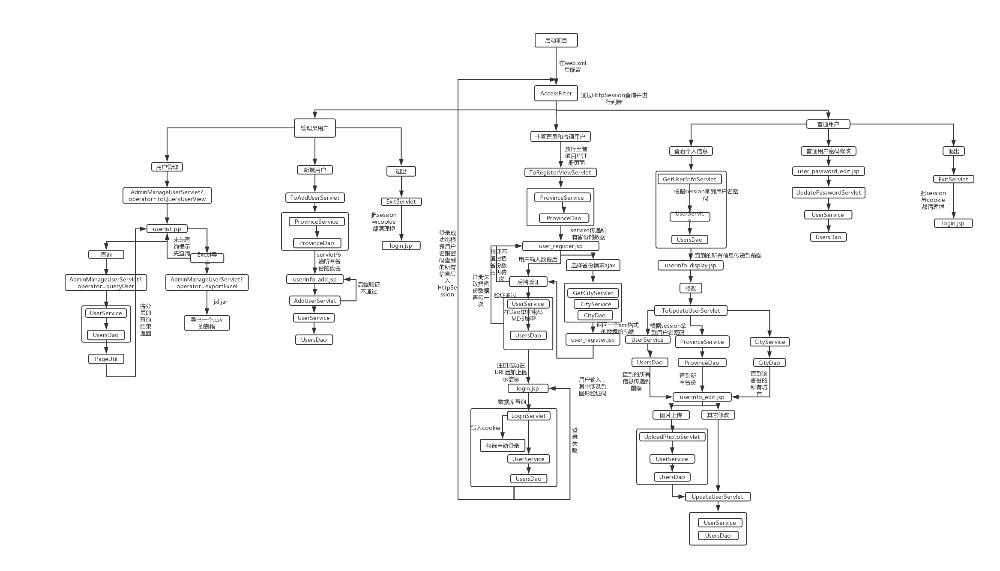
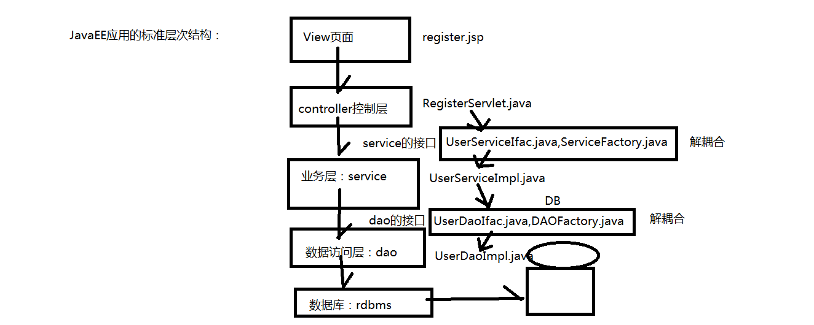

# 仿12306网站


####  项目所用技术点 

```

1. 访问控制过滤器Filter的使用

2. HttpSession的使用

3. servlet传递数据至Jsp

4. JDBC连接池的使用

5. Jsp EL表达式 
https://www.cnblogs.com/czs1982/p/3966748.html

6. Jsp核心标签库的运用
http://how2j.cn/k/jsp/jsp-jstl/578.html

7. ajax输出xml使用

8. Md5加密技术

9. 图形验证码技术

10. Cookie的使用

11. 图片上传

12. 服务端表格分页

13. 导出一个xls Excel表格

```

#### 项目所导入的Jar包

1. jstl-1.2.jar (JSP标准标签库)

2. [jxl.jar](https://bbs.csdn.net/topics/90494976)(Java操作Excel或创建Excel) 

3. ojdbc6.jar Oracle数据驱动

#### 本项目的思维导向图草图



#### 总体架构




#### 配置环境

Jdk 1.8 

Tomcat 8.0.47 

Oracle 11.2.0.1.0

#### 开发工具

Eclipse 4.11.0

PL/SQL 11.2.0.1.0 

Vscode 1.34.0

#### 数据库设计

##### tickets_user

|列名|数据类型|可否为空|说明|
| -- | -- | -- | -- |
| USER_ID | number(11)    | not null  | id(Parimary主键)  |
| USER_NAME | varchar2(30)   | not null | 用户名(Unique唯一)   |
| USER_PASSWORD | varchar2(50)   | not null | 密码   |
| USER_RULE | varchar2(2)  | not null | 权限(1 管理员 2 普通用户) |
| USER_REAL_NAME | varchar2(50)   | not null | 真实姓名   |
| USER_SEX | char(1)    | not null | 性别(1 男 2 女)   |
| USER_CITY_ID | number(11)    | not null | 城市信息id值((Foreign外键tickets_city)) FK_TICKETS_CITY_ID |
| USER_CERTTYPE_ID | number(11)    | not null | 证件类型(1二代身份证2港澳通行证3台湾通行证4护照)(Foreign外键tickets_certtype)FK_TICKETS_CERTTYPE_ID |
| USER_CERT | varchar2(50)    | not null | 证件号码   |
| USER_BIRTHDAY | date   | not null | 生日   |
| USER_USERTYPE_ID | number(11)   | not null | 旅客类型(1成人2儿童3学生4残疾军人、伤残人民警察)((Foreign外键tickets_usertype))FK_TICKETS_USERTYPE_ID |
| USER_CONTENT | varchar2(3000)    | null   | 备注信息   |
| USER_STATUS | char(1)   | not null | 用户状态(0 无效 1 有效)   |
| USER_LOGIN_IP | varchar2(50)   | not null   | 登陆IP   |
| USER_IMAGE_PATH | varchar2(200)    |  not null | 用户头像路径   |

##### tickets_usertype

|列名|数据类型|可否为空|说明|
| -- | -- | -- | -- |
| USERTYPE_ID | number(11)    | not null  | id (主键)  |
| USERTYPE_CONTENT | varchar2(40)   | not null | 旅客类型(1成人2儿童3学生4残疾军人、伤残人民警察)    |

##### tickets_province

|列名|数据类型|可否为空|说明|
| -- | -- | -- | -- |
| PROVINCE_ID | number(11) | not null  | id (主键) |
| PROVINCE_NUM | varchar2(50) | not null | 省份编号 |
| PROVINCE_NAME | varchar2(40) | not null  | 省份名称  |

##### tickets_city

|列名|数据类型|可否为空|说明|
| -- | -- | -- | -- |
| CITY_ID | number(11) | not null  | id (主键) |
| CITY_NUM | varchar2(50) | not null | 城市编号 |
| CITY_NAME | varchar2(50) | not null  | 城市名称  |
| CITY_FATHER | varchar2(6) | not null  | 省份标识  |

#### tickets_certtype

|列名|数据类型|可否为空|说明|
| -- | -- | -- | -- |
| CERTTYPE_ID | number(11)    | not null  | id (主键)  |
| CERTTYPE_CONTENT | varchar2(20)   | not null | 证件类型(1二代身份证2港澳通行证3台湾通行证4护照)|


#### 项目所遇部分bug总结

1. ORA-02291: 违反完整约束条件 (SCOTT.tickets_2_USER_CITY_FK) - 未找到父项关键字


原因:赋值错误 ：赋值city时关联的是id不是cityid

解决: 取得City实体内的id值正确赋值即可

[参考链接](https://blog.csdn.net/jihuanliang/article/details/7205968)

2. bug For input string: "" (其中双引号内可能为C也可能为G等任何字母)


原因：前端JSP页面value里的值为C或G或者任何字母,不能转换成数值。

解决：将前端JSP页面中的value里的值更改为数字类型的字符串即可

3. 数据库能根据用户名密码能够查到而页面却不能登陆


完全是因为自己事务没有学好，特么小废物不知道插入数据之后提交造成的。。。。

4. 跳转jsp页面url后带中文出现乱码

解决：两行Java代码

```
String mes = URLEncoder.encode("注册成功","utf-8");//加码
response.sendRedirect(request.getContextPath() + "/login.jsp?message=" + mes);

String message = URLDecoder.decode(request.getParameter("message"), "utf-8");//解码
```


#### 拓展知识

1. [mysql Navicat12约束条件的设置和详解](https://blog.csdn.net/qq_34168515/article/details/108186202)
2. [navicat表约束怎么弄](https://www.php.cn/tool/navicat/428197.html)
