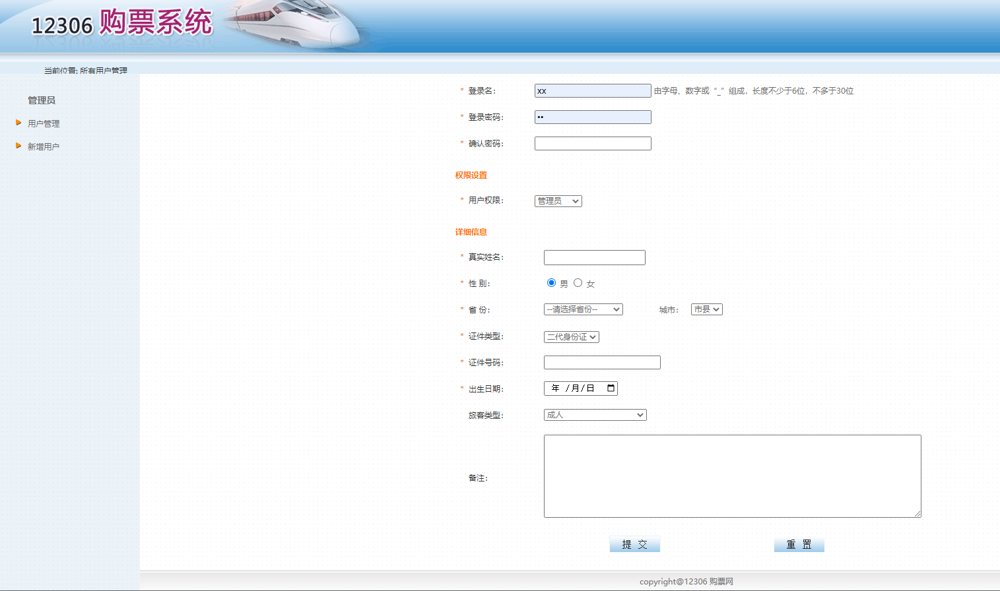
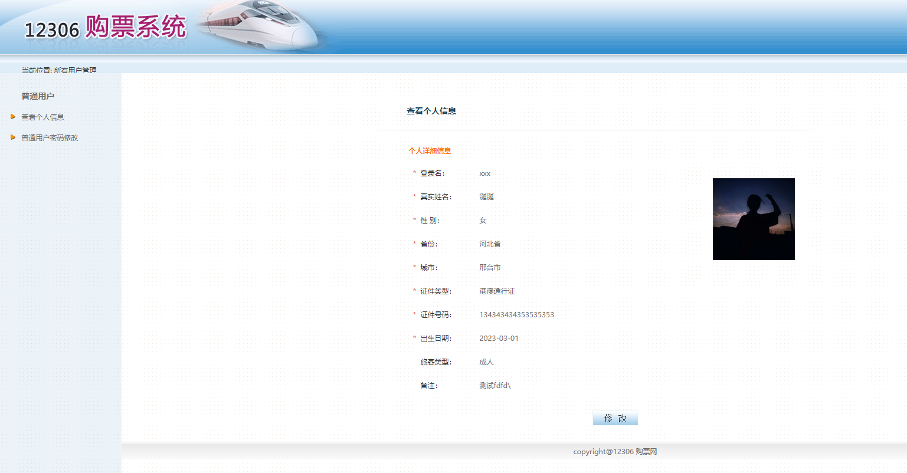
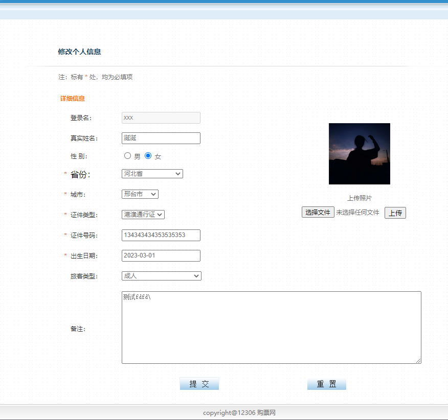

<p align="center">
    <a href='https://docs.oracle.com/en/java/javase/8'></a>
    <a href='https://docs.spring.io/spring-boot/docs/2.6.2-SNAPSHOT/reference/html'></a>
    <a href='https://staging-cn.vuejs.org'></a><br/>
    <a href='#'></a>
    <a href='#'></a>
    <a href='#'></a>
    <a href='#'></a>
</p>

# 购票网

#### 项目说明

+ 此项目为JavaWeb项目，后端纯Java未使用框架，前端为Jsp，实现了前后端数据通信，前后端基本的增删改查功能。

#### 开发环境

+ Windows

#### 配置环境

| 程序           | 版本        | 说明                       |
|--------------|-----------|--------------------------|
| Jdk          | 1.8.0 161 | Java 开发工具包               |
| Mysql        | 5.5.27    | 关系型数据库                   |
| 或者 Oracle    | 11.2.0.1.0    | 关系型数据库                   |
| Apache-Tomcat | 9.0.71     | Java 服务器           |

#### 开发工具

| 工具                       | 版本            | 说明                      |
|--------------------------|---------------|-------------------------|
| Eclipse IDE              | 4.11.0(2022.12)| 后端开发IDE                |
| Vscode IDE              | 1.34.0| 前端开发IDE                |
| Git                      | 2.24.1        | 代码托管平台                  |
| Google   Chrome          | 75.0.3770.100 | 浏览器、前端调试工具              |
| Navicat                  | 12       | 数据库连接工具                 |
| PL/SQL                  | 11.2.0.1.0       | 数据库连接工具                 |
| Postman                  | 7.1.0         | 接口测试工具                  |
| VMware   Workstation Pro | 14.1.3        | 虚拟机(未用到或许你会用到)          |
| PowerDesigner            | 15            | 数据库设计工具(未用到或许你会用到)      |
| SQLyog                   | 12.0.3        | 数据库连接工具 (未用到或许你会用到)     |
| Visio                    | 2013          | 时序图、流程图等绘制工具(未用到或许你会用到) |
| ProcessOn                | ——            | 架构图等绘制工具(未用到或许你会用到)     |
| XMind   ZEN              | 9.2.0         | 思维导图绘制工具(未用到或许你会用到)     |
| RedisDesktop             | 0.9.3.817     | redis客户端连接工具(未用到或许你会用到) |

####  编码规范

- 规范方式：严格遵守阿里编码规约。
- 命名统一：简介最大程度上达到了见名知意。
- 分包明确：层级分明可快速定位到代码位置。
- 注释完整：描述性高大量减少了开发人员的代码阅读工作量。
- 工具规范：使用统一jar包避免出现内容冲突。
- 代码整洁：可读性、维护性高。

#### 包结构

```
 +- tickets
     +- Img --md文件所需的图片
     +- sql --sql语句包
     +- txt --部分知识点总结
        +- src
        	+- main
        	|	+- java
        	|	|	+- net
        	|	|		+- tencent
        	|	|		|	+- tickets
        	|	|		|		+- dao -- 数据访问层，与底层 MySQL 进行数据交互
        	|	|		|		+- entity --实体
        	|	|		|		+- filter --过滤器，控制前端页面访问
        	|	|		|		+- service --dao与servlet解耦合
        	|	|		|		+- servlet -- 主要是处理各种 Http 请求，各类基本参数校验，或者不复用的业务简单处理，返回 JSON 数据等
        	|	|		|		|	+- admin
        	|	|		|		|	+- comm
        	|	|		|		|	+- login
        	|	|		|		|	+- user
        	|	|		|		+- util -- 业务相关工具
        	|	+- webapp
        	|	|	+- admin -- 管理员前端页面
        	|	|	+- css -- 样式
        	|	|	+- images -- 图片
        	|	|	+- js -- 前端页面行为逻辑控制
        	|	|	+- META-INF
        	|	|		+- context.xml -- 数据库的配置
        	|	|	+- photos -- 用户上传头像客户端存储位置
        	|	|	+- user -- 用户前端界面
        	|	|	+- WEB-INF
        				+- lib -- 存放此项目所用的各种jar包
        				+- web.xml -- 配置默认显示的前端页面和过滤器的配置
```

#### 项目所导入的Jar包

1. jstl-1.2.jar (JSP标准标签库)
2. [jxl.jar](https://bbs.csdn.net/topics/90494976)(Java操作Excel或创建Excel) 
3. ojdbc6.jar Oracle数据驱动
3. mysql-connector-java-5.1.39-bin.jar mysql数据驱动
3. Java生成Json传输给前端的接口驱动

```
commons-beanutils-1.7.0.jar
commons-collections-3.1.jar
commons-lang-2.5.jar
commons-logging-1.1.1.jar
ezmorph-1.0.3.jar
json-lib-2.1-jdk15.jar
```

6. 上传照片功能需要的jar包

```
commons-fileupload-1.3.1.jar
commons-io-2.4.jar
```

#### 搭建运行本项目步骤

1. 确保已配置好jdk1.8的环境且与Eclipse开发工具相匹配
2. 确保已安装好Tomcat配置环境且和Eclipse开发工具配置完成
3. 导入了以应的jar包


4. 将tickets_all.sql导入自己的navicat执行并生成对应的mysql数据库数据 前提是要配置好自己的mysql数据库跟navicat可视化工具
5. 配置自己mysql数据库在META-INF下的context.xml

```xml
<?xml version="1.0" encoding="UTF-8"?>
<Context>
	<Resource name="jdbc/mysql" 
	auth="Container" 
	type="javax.sql.DataSource"
	username="root"
	password="123456"
	url="jdbc:mysql://localhost:3306/tickets"
	driverClassName="com.mysql.jdbc.Driver"
	maxIdle="2"
	maxWait="5000"
	maxActive="4" />
</Context>
```

6. 配置默认显示页面以及拦截器 WEB-INF下的web.xml 当然拦截器需要自己完成对应的功能，这里只是配置

```xml
<?xml version="1.0" encoding="UTF-8"?>
<web-app xmlns:xsi="http://www.w3.org/2001/XMLSchema-instance" xmlns="http://xmlns.jcp.org/xml/ns/javaee" xsi:schemaLocation="http://xmlns.jcp.org/xml/ns/javaee http://xmlns.jcp.org/xml/ns/javaee/web-app_4_0.xsd" id="WebApp_ID" version="4.0">
  <display-name>tickets</display-name>

<!--	拦截器-->
	<filter>
		<filter-name>f1</filter-name>
		<filter-class>net.tencent.tickets.filter.AccessFilter</filter-class>
	</filter>
	<filter-mapping>
		<filter-name>f1</filter-name>
		<url-pattern>/*</url-pattern>
	</filter-mapping>
<!--  默认显示页面-->
  <welcome-file-list>
    <welcome-file>index.html</welcome-file>
    <welcome-file>login.jsp</welcome-file>
    <welcome-file>index.htm</welcome-file>
    <welcome-file>default.html</welcome-file>
    <welcome-file>default.jsp</welcome-file>
    <welcome-file>default.htm</welcome-file>
  </welcome-file-list>
</web-app>
```

7. 在Eclipse里导入此项目-->右键此项目-->Run As-->Run On Server-->在弹出的对话框选择自己的Tomcat-->Next-->Finish-->启动成功后你的默认浏览器会自动弹出一个名为 http://localhost:8080/tickets/ 的页面表明启动成功


8. txt文件夹有部分知识点总结

####  项目所用技术点 

1. 访问控制过滤器Filter的使用
2. HttpSession的使用
3. servlet传递数据至Jsp
4. JDBC连接池的使用
5. Jsp EL表达式 
6. Jsp核心标签库的运用
7. ajax输出xml或Json使用
8. Md5加密技术
9. 图形验证码技术
10. Cookie的使用
11. 图片上传
12. 服务端表格分页
13. 导出一个xls Excel表格
14. 单例模式的使用

```
//	 单例模式实现步骤：
//	 1.构造器私有
//	 2.提供私有的静态的当前类类型的变量
//	 3.提供一个公共的静态方法，返回刚才定义的变量，如果这个变量为null，那么给他赋值
```

+ 核心代码示例代码 Service

```Java
package net.tencent.tickets.service;

import java.util.List;

import net.tencent.tickets.dao.CityDao;
import net.tencent.tickets.entity.City;

public class CityService {
	
	//属性依赖cityDao
	private CityDao cityDao = CityDao.getInstance();
	
	/**
	 * 
	 * <p>Title: getCityByProvinceNum</p>  
	 * <p>
	 *	Description: 
	 *	获取指定省份的城市信息的业务方法
	 * </p> 
	 * @param provinceNum
	 * @return
	 */
	public List<City> getCityByProvinceNum(String provinceNum) {
		return cityDao.queryCityByProvinceNum(provinceNum);
	}
	/**
	 * <p>Title: queryCityByCityNum</p>
	 * <p>
	 *    Description:
	 * </p>
	 * <p>Copyright: Copyright (c) 2017</p>
	 * <p>Company: www.baidudu.com</p>
	 * @param cityNum
	 * @return
	 * @author xianxian
	 * @date 2023年3月2日下午6:08:03
	 * @version 1.0
	 */
	public City queryCityByCityNum(String cityNum) {
		return cityDao.queryCityByCityNum(cityNum);
	}
	
	private CityService(){}
	
	private static CityService cityService;
	
	public static CityService getInstance() {
		if (cityService == null) {
			cityService = new CityService();
		}
		return cityService;
	}

}
```

+ dao

```Java
package net.tencent.tickets.dao;

import java.sql.Connection;
import java.sql.PreparedStatement;
import java.sql.ResultSet;
import java.util.ArrayList;
import java.util.List;

import net.tencent.tickets.entity.City;
import net.tencent.tickets.entity.Province;
import net.tencent.tickets.service.ProvinceService;
import net.tencent.tickets.servlet.other.ProvinceServlet;
import net.tencent.tickets.util.DBUtils_pool;

public class CityDao {
	
	/** 根据省份编号查询所有城市的sql语句 **/
	private static final String QUERY_CITY_BY_PROVINCENUM = 
			"SELECT CITY_ID,CITY_NUM,CITY_NAME,CITY_FATHER from tickets_city where CITY_FATHER=?";
	
	/** 根据城市编号查询城市所有  **/
	
	private static final String QUERY_CITY_BY_CITYNUM = 
			"SELECT CITY_ID,CITY_NUM,CITY_NAME,CITY_FATHER from tickets_city where CITY_NUM=?";
	
	
	/**
	 * <p>Title: queryCityByCityNum</p>
	 * <p>
	 *    Description:
	 * </p>
	 * <p>Copyright: Copyright (c) 2017</p>
	 * <p>Company: www.baidudu.com</p>
	 * @param cityNum
	 * @return
	 * @author xianxian
	 * @date 2023年3月2日下午6:08:47
	 * @version 1.0
	 */
	public City queryCityByCityNum(String cityNum) {
		City city = new City();
		Connection conn = null;
		PreparedStatement stmt = null;
		ResultSet rs = null;
		try {
			conn = DBUtils_pool.getConnection();
			stmt = conn.prepareStatement(QUERY_CITY_BY_CITYNUM);
			stmt.setString(1, cityNum);
			rs = stmt.executeQuery();
			while (rs.next()) {
				city.setCityNum(rs.getString("CITY_NUM"));
				city.setId(rs.getInt("CITY_ID"));
				city.setCityName(rs.getString("CITY_NAME"));
				
				ProvinceService provinceService = ProvinceService.getInstance();
				Province province = provinceService.queryProvinceByProvinceNum(rs.getString("CITY_FATHER"));
				
				city.setProvince(province);
			}
		} catch (Exception e) {
			e.printStackTrace();
		} finally {
			DBUtils_pool.release(conn, stmt, rs);
		}
		return city;
	}
	

	
	/**
	 * (non-Javadoc)
	 * <p>Title: queryCityByProvinceNum</p>
	 * <p>
	 *    Description:获取指定省份的所有城市信息
	 * </p>
	 * <p>Copyright: Copyright (c) 2017</p>
	 * <p>Company: www.baidudu.com</p>
	 * @param provinceNum
	 * @return
	 * @see net.tencent.tickets.dao.ifac.CityDaoIfac#queryCityByProvinceNum(java.lang.String)
	 * @author xianxian
	 * @date 2023年2月25日下午9:10:45
	 * @version 1.0
	 */
	public List<City> queryCityByProvinceNum(String provinceNum) {
		List<City> cities = new ArrayList<>();
		Connection conn = null;
		PreparedStatement stmt = null;
		ResultSet rs = null;
		try {

			conn = DBUtils_pool.getConnection();
			stmt = conn.prepareStatement(QUERY_CITY_BY_PROVINCENUM);
			stmt.setString(1, provinceNum);
			rs = stmt.executeQuery();
			while (rs.next()) {
				City c = new City();

				c.setCityNum(rs.getString("CITY_NUM"));
				c.setId(rs.getInt("CITY_ID"));
				c.setCityName(rs.getString("CITY_NAME"));
				c.setProvince(new Province(null,rs.getString("CITY_FATHER"),null));

				cities.add(c);

			}
		} catch (Exception e) {
			e.printStackTrace();
		} finally {
			DBUtils_pool.release(conn, stmt, rs);
		}
		return cities;
	}

//	 单例模式实现步骤：
//	 1.构造器私有
//	 2.提供私有的静态的当前类类型的变量
//	 3.提供一个公共的静态方法，返回刚才定义的变量，如果这个变量为null，那么给他赋值
	private CityDao() {};
	private static CityDao cityDao;
	public static CityDao getInstance() {
		if(cityDao == null) {
			cityDao = new CityDao();
		}
		return cityDao;
	}
}
```

+ 调用

```Java
CityService cityService = CityService.getInstance();
City city = cityService.queryCityByCityNum(cityNum);
```


#### 本项目的思维导向图草图


#### 总体架构


#### 数据库设计

##### tickets_user

|列名|数据类型|可否为空|说明|
| -- | -- | -- | -- |
| USER_ID | number(11)    | not null  | id(Parimary主键)  |
| USER_NAME | varchar2(30)   | not null | 用户名(Unique唯一)   |
| USER_PASSWORD | varchar2(50)   | not null | 密码   |
| USER_RULE | varchar2(2)  | not null | 权限(1 管理员 2 普通用户) |
| USER_REAL_NAME | varchar2(50)   | not null | 真实姓名   |
| USER_SEX | char(1)    | not null | 性别(1 男 2 女)   |
| USER_CITY_ID | number(11)    | not null | 城市信息id值(Foreign外键tickets_city)FK_TICKETS_CITY_ID |
| USER_CERTTYPE_ID | number(11)    | not null | 证件类型(1二代身份证2港澳通行证3台湾通行证4护照)(Foreign外键tickets_certtype)FK_TICKETS_CERTTYPE_ID |
| USER_CERT | varchar2(50)    | not null | 证件号码   |
| USER_BIRTHDAY | date   | not null | 生日   |
| USER_USERTYPE_ID | number(11)   | not null | 旅客类型(1成人2儿童3学生4残疾军人、伤残人民警察)((Foreign外键tickets_usertype))FK_TICKETS_USERTYPE_ID |
| USER_CONTENT | varchar2(3000)    | null   | 备注信息   |
| USER_STATUS | char(1)   | not null | 用户状态(0 无效 1 有效)   |
| USER_LOGIN_IP | varchar2(50)   | not null   | 登陆IP   |
| USER_IMAGE_PATH | varchar2(200)    |  not null | 用户头像路径   |

##### tickets_usertype

|列名|数据类型|可否为空|说明|
| -- | -- | -- | -- |
| USERTYPE_ID | number(11)    | not null  | id (主键)  |
| USERTYPE_CONTENT | varchar2(40)   | not null | 旅客类型(1成人2儿童3学生4残疾军人、伤残人民警察)    |

##### tickets_province

|列名|数据类型|可否为空|说明|
| -- | -- | -- | -- |
| PROVINCE_ID | number(11) | not null  | id (主键) |
| PROVINCE_NUM | varchar2(50) | not null | 省份编号 |
| PROVINCE_NAME | varchar2(40) | not null  | 省份名称  |

##### tickets_city

|列名|数据类型|可否为空|说明|
| -- | -- | -- | -- |
| CITY_ID | number(11) | not null  | id (主键) |
| CITY_NUM | varchar2(50) | not null | 城市编号 |
| CITY_NAME | varchar2(50) | not null  | 城市名称  |
| CITY_FATHER | varchar2(6) | not null  | 省份标识(Foreign外键tickets_province)FK_TICKETS_PROVINCE_NUM |

##### tickets_certtype

|列名|数据类型|可否为空|说明|
| -- | -- | -- | -- |
| CERTTYPE_ID | number(11)    | not null  | id (主键)  |
| CERTTYPE_CONTENT | varchar2(20)   | not null | 证件类型(1二代身份证2港澳通行证3台湾通行证4护照)|


#### 本项目部分业务功能及其实现简介

1. 验证码功能


+ Java 利用26个英文字母以及十个数字随机组合成四位验证码
+ 且字体颜色随机
+ 干扰线随机
+ 产生的验证码存入Session，并以图片的形式传给前端显示 
+ 登录验证之时服务端取session里的验证码的值进行验证

2. 自动登录功能


+ 前端将是否自动登录的标识传给Java后台

+ Java根据标识将用户名与MD5加密后的密码存入前端的cookie中

+ 前端每次登录之时判断浏览器中是否有存入cookie若有则取到用户名与密码直接发到到后台

+ Java后台根据前端传入的用户名与密码实现自动登录的功能(有cookie且用户名与密码验证成功则跳过验证码实现自动登录)


3. 管理员用户管理查询展示列表功能


+ 当前端点击查询按钮时Java后台根据前端传入的数据进行查询并返回给前端
+ 查询结果存入session

```java
PageUtil pageUtil = new PageUtil(users, Integer.parseInt(pageCount), 1);
request.setAttribute("userList", pageUtil.getUsers_page());// 把查询结果users传给userlist.jsp页面
request.setAttribute("pagesum", pageUtil.getPagesum());// 总页数
request.setAttribute("pageNumber", pageUtil.getPageNumber());// 页码
request.getRequestDispatcher("/admin/userlist.jsp").forward(request, response);
```

+ 前端根据查询结果返回的数据通过jsp页面的如下代码进行展示数据

```jsp
<c:forEach items="${userList}" var="u" varStatus="status">

    <tr align="center">
        <td bordercolor="#FFFFFF" class="text_cray1"><input type="checkbox" name="checkbox"
                                                            value="${u.id}"></td>
        <td width="98" bordercolor="#FFFFFF" class="text_cray1">${u.userName}</td>
        <td width="80" bordercolor="#FFFFFF" class="text_cray1">${u.userSex==49?"男":"女"}</td>
        <td width="132" bordercolor="#FFFFFF" class="text_cray1">${u.certType.content}</td>
        <td width="247" bordercolor="#FFFFFF" class="text_cray1">${u.userCert}</td>
        <td width="82" bordercolor="#FFFFFF" class="text_cray1">${u.userType.content}</td>
        <td width="89" bordercolor="#FFFFFF" class="text_cray1">
            <span class="text_red" style="cursor:pointer;">编辑</span>
        </td>
    </tr>

</c:forEach>
```

4. 查询结果全选功能


+ 前端功能实现

```javascript
let objMethod = {
    selectAllNullorReserve: function (order) {
        let checkboxArray = $('input[type="checkbox"]');
        switch (order) {
            case "全选":
                for (let i = 0; i < checkboxArray.length; i++) {
                    if (!checkboxArray.eq(i).attr("checked")) {
                        checkboxArray.eq(i).attr("checked", true);
                    }
                }
                break;
            case "全不选":
                for (let i = 0; i < checkboxArray.length; i++) {
                    if (checkboxArray.eq(i).attr("checked")) {
                        checkboxArray.eq(i).attr("checked", false);
                    }
                }
                break;
            case "反选":
                for (let i = 0; i < checkboxArray.length; i++) {
                    if (checkboxArray.eq(i).attr("checked")) {
                        checkboxArray.eq(i).attr("checked", false);
                    } else {
                        checkboxArray.eq(i).attr("checked", true);
                    }
                }
                break;
            default:
                break;
        }
    }
}
```

5. 分页展示功能


+ Java后端分页 由于点击查询时所得到的结果都存入了session中，只需要将页码数值传入后端根据下标来截取对应的数值给前端就行了
+ 前端展示即可

```jsp
<td width="154" align="right" class="text_cray1" style="width:20%"><label class="text_cray">
    每页显示
    <select name="pageCount" id="select_pageCount">
        <option value="10" ${pageCount.equals("10")?"selected":""}>10</option>
        <option value="20" ${pageCount.equals("20")?"selected":""}>20</option>
        <option value="30" ${pageCount.equals("30")?"selected":""}>30</option>
    </select>
    条信息</label>
</td>
```

```javascript
// 分页改变时
$("#select_pageCount").change(function () {
    $("#form_queryUser").submit();
})
```

```jsp
<form name="form1" method="post" id="form_queryUser" action="<%=request.getContextPath()%>/AdminManageUserServlet?operator=queryUser">
```


6. 点击页码跳转到对应的页的功能


+ Java后端分页 由于点击查询时所得到的结果都存入了session中，只需要将页码数值传入后端根据下标来截取对应的数值给前端就行了
+ 前端展示即可

```jsp
<td width="284" align="center" class="text_cray">>>

    <% Integer pagesum = (Integer) request.getAttribute("pagesum");
    Integer pageNumber = (Integer) request.getAttribute("pageNumber");
    if (pagesum != null && pagesum != 0) {
        for (int i = 1; i <= pagesum; i++) {
            if (i == pageNumber) {
                %>
    <a href="#" style="text-decoration: underline"><%=i%>&nbsp;&nbsp;</a>
    <%} else { %>
    <a href="#" onclick="queryUserByPage(<%=i%>)" style="text-decoration:none;"><%=i%>&nbsp;&nbsp;</a>
    <%}}}%>
    <script>
        function queryUserByPage(i) {
            // alert(1);
            var form = document.getElementById("form_queryUser");
            form.action = "<%=request.getContextPath()%>/AdminManageUserServlet?operator=queryUserByPage&pageNumber=" + i;
            form.submit();
            form.action = "<%=request.getContextPath()%>/AdminManageUserServlet?operator=queryUser";//请还原，否则点击查询按钮会分页查询
        }
    </script>
    &lt;&lt;
</td>
```

7. Excel导出功能


+ 导入对应的jar包到对应的lib文件夹下 jxl.jar

```java
private void exportExcel(HttpServletRequest request,
                         HttpServletResponse response) throws ServletException, IOException{

    HttpSession session = request.getSession();

    @SuppressWarnings("unchecked")
    List<Users> users = (List<Users>)session.getAttribute("users");

    if(users == null || users.size() == 0)
    {
        response.setContentType("text/html;charset=utf-8");
        response.getWriter().println("<script>alert('请先查询');</script>");
    }else
    {
        response.setHeader("Content-disposition", "attachment; filename="
                           + new String("用户".getBytes("GB2312"), "8859_1") + 
                           ".xls");
        response.setHeader("pragma", "no-cache");
        response.setContentType("application/msexcel");
        ServletOutputStream os = response.getOutputStream();
        WritableWorkbook workbook = Workbook.createWorkbook(os);

        WritableSheet ws = workbook.createSheet("用户列表", 0);

        try {
            //首先写表头：id username
            ws.addCell(new Label(0, 0, "id"));
            ws.addCell(new Label(1, 0, "用户名"));
            ws.addCell(new Label(2, 0, "性别"));
            ws.addCell(new Label(3, 0, "证件类型"));
            ws.addCell(new Label(4, 0, "证件号码"));
            ws.addCell(new Label(5, 0, "旅客类型"));


            for(int row = 1;row <= users.size();row++)
            {
                Users user = users.get(row-1);
                ws.addCell(new Label(0, row, user.getId()+""));
                ws.addCell(new Label(1, row, user.getUserName()));
                ws.addCell(new Label(2, row, user.getUserSex() == 49 ? "男" : "女"));
                ws.addCell(new Label(3, row, user.getCertType().getContent()));
                ws.addCell(new Label(4, row, user.getUserCert()));
                ws.addCell(new Label(5, row, user.getUserType().getContent()));
            }

            workbook.write();
        } catch (Exception e) {
            e.printStackTrace();
        }finally
        {
            try {
                workbook.close();
            } catch (WriteException e) {
                e.printStackTrace();
            }
        }
    }	
}
```

+ 前端调用即可

8. 新增用户功能



+ 实现步骤
+ 核心代码为一句sql语句

```sql
	private static final String ADD_USER = "INSERT INTO tickets_user(tickets_user.USER_ID,tickets_user.USER_NAME,tickets_user.USER_PASSWORD,tickets_user.USER_RULE,\r\n"
			+ "tickets_user.USER_REAL_NAME,tickets_user.USER_SEX,tickets_user.USER_CITY_ID,tickets_user.USER_CERTTYPE_ID,\r\n"
			+ "tickets_user.USER_CERT,tickets_user.USER_BIRTHDAY,tickets_user.USER_USERTYPE_ID,tickets_user.USER_CONTENT,tickets_user.USER_STATUS,tickets_user.USER_LOGIN_IP,tickets_user.USER_IMAGE_PATH)\r\n"
			+ "values (NULL,?,?,?,?,?,?,?,?,?,?,?,'1',?,'')";
```

9. 展示当前在线人数功能


+ 实现步骤
+ 在登录之时将统计核心代码如下

```Java
	/**
	 * 统计上线人数
	 * @param request
	 */
	private void online(HttpServletRequest request) {
		ServletContext application = request.getServletContext();
		Object obj = application.getAttribute("onlineCount");
		//第一次进来
		if(obj == null)
		{
			application.setAttribute("onlineCount", 1);
		}
		//下一次进来
		else
		{
			application.setAttribute("onlineCount", (Integer)obj + 1);
		}
	}
```

+ 前端展示

```jsp
    <td width="200" valign="top" bgcolor="#deedf8" class="text_cray1">
    欢迎您，${sessionScope.user.userName}，
      当前在线人数:${onlineCount }
    </td>
```

10. 欢迎XX用户功能


+ 实现步骤
+ 登录之时存入了session，Java核心代码

```java
// 保存用户登陆信息-----------------------------session:在一次会话中保存数据
session.setAttribute("user", user);
```

+ 前端展示

```jsp
<td width="200" valign="top" bgcolor="#deedf8" class="text_cray1">
    欢迎您，${sessionScope.user.userName}，
    当前在线人数:${onlineCount }
</td>
```

11. 退出登录功能


+ 后端清除cookie与session后跳转login页面即可

12. 普通用户查看个人信息功能




+ 后台核心代码

```sql
	private static final String QUERY_USER_BY_USERNAME_AND_PASSWORD = "SELECT\r\n"
			+ "	tickets_user.USER_ID,\r\n"
			+ "	tickets_user.USER_NAME,\r\n"
			+ "	tickets_user.USER_PASSWORD,\r\n"
			+ "	tickets_user.USER_RULE,\r\n"
			+ "	tickets_user.USER_REAL_NAME,\r\n"
			+ "	tickets_user.USER_SEX,\r\n"
			+ "	tickets_user.USER_CITY_ID,\r\n"
			+ "	tickets_user.USER_CERTTYPE_ID,\r\n"
			+ "	tickets_user.USER_CERT,\r\n"
			+ "	tickets_user.USER_BIRTHDAY,\r\n"
			+ "	tickets_user.USER_USERTYPE_ID,\r\n"
			+ "	tickets_user.USER_CONTENT,\r\n"
			+ "	tickets_user.USER_STATUS,\r\n"
			+ "	tickets_user.USER_LOGIN_IP,\r\n"
			+ "	tickets_user.USER_IMAGE_PATH,\r\n"
			+ "	tickets_city.CITY_ID,\r\n"
			+ "	tickets_city.CITY_NUM,\r\n"
			+ "	tickets_city.CITY_NAME,\r\n"
			+ "	tickets_city.CITY_FATHER,\r\n"
			+ "	tickets_province.PROVINCE_ID,\r\n"
			+ "	tickets_province.PROVINCE_NUM,\r\n"
			+ "	tickets_province.PROVINCE_NAME,\r\n"
			+ "	tickets_certtype.CERTTYPE_CONTENT,\r\n"
			+ "	tickets_usertype.USERTYPE_CONTENT\r\n"
			+ "FROM\r\n"
			+ "	tickets_user,\r\n"
			+ "	tickets_city,\r\n"
			+ "	tickets_province,\r\n"
			+ "	tickets_certtype,\r\n"
			+ "	tickets_usertype\r\n"
			+ "WHERE\r\n"
			+ "	tickets_user.USER_CITY_ID = tickets_city.CITY_ID \r\n"
			+ "	AND tickets_user.USER_USERTYPE_ID = tickets_usertype.USERTYPE_ID\r\n"
			+ "	AND tickets_user.USER_CERTTYPE_ID = tickets_certtype.CERTTYPE_ID\r\n"
			+ "	AND tickets_city.CITY_FATHER = tickets_province.PROVINCE_NUM\r\n"
			+ "	AND tickets_user.USER_NAME = ? "
			+ "	AND tickets_user.USER_PASSWORD = ? ";
```

+ 前端展示

```jsp
<table width="100%" border="0" cellspacing="0">
    <tr>
        <td height="30">&nbsp;</td>
    </tr>
</table>
<table width="835" border="0" align="center" cellpadding="0" cellspacing="0">
    <tr>
        <td height="20" colspan="2" align="center" ></td>
    </tr>
    <tr>
        <td width="64" align="center" ></td>
        <td width="771" height="30" align="left" valign="top" >
            <span class="text_blod_title">查看个人信息</span>
        </td>
    </tr>
    <tr>
        <td height="15" colspan="2" >
            /images/line1.jpg" width="835" height="6">
        </td>
    </tr>
    <tr>
        <td colspan="2" valign="top"  ><table width="700" border="0" align="center" cellpadding="0" cellspacing="0">
            <tr>
                <td height="20" colspan="4"  ></td>
            </tr>
            <tr>
                <td height="15" colspan="4" align="left" class="text_title">个人详细信息</td>
            </tr>
            <tr>
                <td height="10" colspan="4" ></td>
            </tr>
            <tr>
                <td width="20" height="40" align="center" class="text_red">*</td>
                <td width="100" height="40" align="left" class="text_cray1">登录名：</td>
                <td width="350" align="left" class="text_cray"><%=user.getUserName() %></td>
                <td width="230" rowspan="5" align="center"
                    background="<%=request.getContextPath() %>/images/bg_point_write.gif" class="text_cray">
                    " width="139" height="139" id="userImage">
                </td>
            </tr>
            <tr>
                <td width="20" height="40" align="center" class="text_red">*</td>
                <td width="100" height="40" align="left" class="text_cray1">真实姓名：</td>
                <td align="left" class="text_cray"><%=user.getUserRealName() %></td>
            </tr>
            <tr>
                <td width="20" height="40" align="center" class="text_red">*</td>
                <td width="100" height="40" align="left" class="text_cray1">性 别：</td>
                <td align="left" class="text_cray">
                    ${userinfo.userSex == 49 ? "男" : "女"}
                </td>
            </tr>
            <tr>
                <td width="20" height="40" align="center" class="text_red">*</td>
                <td width="100" height="40" align="left" class="text_cray1">省份：</td>
                <td align="left" class="text_cray"><%=user.getCity().getProvince().getProvinceName() %></td>
            </tr>
            <tr>
                <td width="20" height="40" align="center" class="text_red">*</td>
                <td width="100" height="40" align="left" class="text_cray1">城市：</td>
                <td align="left" class="text_cray"><%=user.getCity().getCityName() %></td>
            </tr>
            <tr>
                <td width="20" height="40" align="center" class="text_red">*</td>
                <td width="100" height="40" align="left" class="text_cray1">证件类型：</td>
                <td colspan="2" align="left" class="text_cray"><%=user.getCertType().getContent() %></td>
            </tr>
            <tr>
                <td width="20" height="40" align="center" class="text_red">*</td>
                <td width="100" height="40" align="left" class="text_cray1">证件号码：</td>
                <td colspan="2" align="left" class="text_cray"><%=user.getUserCert() %></td>
            </tr>
            <tr>
                <td width="20" height="40" align="center" class="text_red">*</td>
                <td width="100" height="40" align="left" class="text_cray1">出生日期：</td>
                <td colspan="2" align="left" class="text_cray"><%=user.getUserBirthday() %></td>
            </tr>
            <tr>
                <td width="20" height="40" ></td>
                <td width="100" height="40" align="left" class="text_cray1">旅客类型：</td>
                <td colspan="3" align="left" class="text_cray"><%=user.getUserType().getContent() %></td>
            </tr>
            <tr>
                <td width="20" height="40"></td>
                <td width="100" height="40" align="left" class="text_cray1">备注：</td>
                <td height="40" colspan="2" align="left" class="text_cray"><%=user.getUserContent() %></td>
            </tr>
            </table>
```


13. 普通用户修改个人信息功能



+ 核心Java代码

```Java
String update_user_sql="UPDATE tickets_user \r\n"
    + "SET tickets_user.USER_REAL_NAME =?,\r\n"
    + "tickets_user.USER_SEX =?,\r\n"
    + "tickets_user.USER_CITY_ID =?,\r\n"
    + "tickets_user.USER_CERTTYPE_ID =?,\r\n"
    + "tickets_user.USER_CERT =?,\r\n"
    + "tickets_user.USER_BIRTHDAY =?,\r\n"
    + "tickets_user.USER_USERTYPE_ID =?,\r\n"
    + "tickets_user.USER_CONTENT =? \r\n"
    + "WHERE\r\n"
    + "	tickets_user.USER_ID =?";
```

14. 普通用户上传头像功能


+ 前端

```jsp
<td align="center">
    <input name="uploadFile" type="file" class="text_cray" size="20" id="txt_uploadFile"/>
    <input type="button" value="上传" id="btn_uploadFile"
           style="position: relative;top: -21px;left: 70px;" />
</td>
```

```javascript
document.querySelector("#btn_uploadFile").onclick = () =>
{
    //txt_uploadFile
    let txt_uploadFile = document.querySelector("#txt_uploadFile").value;
    if(txt_uploadFile){
        //表单提交，上传照片，告诉我是成功还是失败，最好回显照片
        //1.获取表单元素
        let form = document.querySelector("#edit_form");
        //2.修改表单的属性：支持进行二进制数据的提交
        form.encoding = "multipart/form-data";
        //3.指定处理上传图片请求的servlet
        form.action = "UploadPhotoServlet";
        //4.表单提交
        form.submit();
        //以下代码将表单属性还原
        //需要修改表单的enctype属性，js中的代码如下：
        form.encoding = "application/x-www-form-urlencoded";
        form.action = "UpdateUserServlet";
    }else{
        document.querySelector("#tip_text").innerText = "请先选择文件!";
    }
}
document.querySelector("#txt_uploadFile").onclick = () => {
    document.querySelector("#tip_text").innerText = "";
}
```

+ 后端代码

```java
package net.tencent.tickets.servlet.user;

import java.io.File;
import java.io.IOException;
import java.io.PrintWriter;

import javax.servlet.ServletException;
import javax.servlet.annotation.MultipartConfig;
import javax.servlet.annotation.WebServlet;
import javax.servlet.http.HttpServlet;
import javax.servlet.http.HttpServletRequest;
import javax.servlet.http.HttpServletResponse;
import javax.servlet.http.HttpSession;
import javax.servlet.http.Part;

import net.tencent.tickets.entity.Users;
import net.tencent.tickets.service.UserService;

/**
 * 负责处理上传照片的servlet
 */
@WebServlet("/UploadPhotoServlet")
@MultipartConfig
public class UploadPhotoServlet extends HttpServlet {
	private static final long serialVersionUID = 1L;

	@Override
	protected void service(HttpServletRequest request, HttpServletResponse response)
			throws ServletException, IOException {
		/*
		 * 1.后台使用servlet3.0技术上传照片
		 * 2.上传照片需要指定服务器上照片保存的地址，photos文件夹保存照片
		 * 3.所以要拿到照片的存储路径，方便回显数据
		 */
		
		request.setCharacterEncoding("utf-8");
		response.setCharacterEncoding("utf-8");
		response.setContentType("text/html;charset=utf-8");
		

		// 获取上传的文件集合
		//Collection<Part> parts = request.getParts();
		// 上传单个文件
	
			// Servlet3.0将multipart/form-data的POST请求封装成Part，通过Part对上传的文件进行操作。
			// Part part = parts[0];//从上传的文件集合中获取Part对象
			Part part = request.getPart("uploadFile");// 通过表单file控件(<input type="file" name="file">)的名字直接获取Part对象
			// Servlet3没有提供直接获取文件名的方法,需要从请求头中解析出来
			// 获取请求头，请求头的格式：form-data; name="file"; filename="snmp4j--api.zip"
			String header = part.getHeader("content-disposition");
			
			// 获取文件名
			String fileName = getFileName(header);
			
			// 存储路径 存到了服务器的路径 客户端的文件夹是看不到的 布署完成后可直接使用
			String saveServletPath = request.getServletContext().getRealPath("/photos") + File.separator + fileName;
			
			// 把文件写到指定路径
			//UUID.randomUUID()+".jpg"
			part.write(saveServletPath);

			//把这个照片路径保存到数据库
			HttpSession session = request.getSession();
			Users user_session = (Users)session.getAttribute("user");
			UserService userService = UserService.getInstance();
			Users user = userService.login(user_session.getUserName(), user_session.getUserPassword());
			

			//判断是否上传成功
			if(UserService.getInstance().saveImage(user.getId(),fileName)) {
				//回到更新用户信息页面，让用户看到自己的照片
				response.sendRedirect("ToUpdateUserServlet");
			}else {
				PrintWriter pw = response.getWriter();
				pw.println("<script>alert('上传照片失败，请稍后再试！');</script>");
				pw.flush();
				pw.close();
			}
			
	}
	/**
	 * 
	 * <p>Title: getFileName</p>  
	 * <p>
	 *	Description: 
	 *	根据请求头解析出文件名 请求头的格式：火狐和google浏览器下：form-data; name="file";
	 * filename="snmp4j--api.zip" IE浏览器下：form-data; name="file";
	 * filename="E:\snmp4j--api.zip"
	 * </p> 
	 * @param header 请求头
	 * @return 文件名
	 */
	public String getFileName(String header) {
		/**
		 * String[] tempArr1 =
		 * header.split(";");代码执行完之后，在不同的浏览器下，tempArr1数组里面的内容稍有区别
		 * 火狐或者google浏览器下：
		 * tempArr1={form-data,name="file",filename="snmp4j--api.zip"}
		 * IE浏览器下：tempArr1={form-data,name="file",filename="E:\snmp4j--api.zip"}
		 */
		String[] tempArr1 = header.split(";");
		/**
		 * 火狐或者google浏览器下：tempArr2={filename,"snmp4j--api.zip"}
		 * IE浏览器下：tempArr2={filename,"E:\snmp4j--api.zip"}
		 */
		String[] tempArr2 = tempArr1[2].split("=");
		// 获取文件名，兼容各种浏览器的写法
		String fileName = tempArr2[1].substring(tempArr2[1].lastIndexOf("\\") + 1).replaceAll("\"", "");
		return fileName;
	}
	
}
```


15. 普通用户修改密码功能


+ 核心代码

```java
String update_user_sql="UPDATE tickets_user SET USER_PASSWORD =? WHERE	USER_ID =?";
```


#### 拓展知识

1. [mysql Navicat12约束条件的设置和详解](https://blog.csdn.net/qq_34168515/article/details/108186202)
2. [navicat表约束怎么弄](https://www.php.cn/tool/navicat/428197.html)
2. [**Java过滤器Filter使用详解**](https://cloud.tencent.com/developer/article/1084375)
2. [java之Cookie具体解释](https://www.cnblogs.com/lytwajue/p/7243006.html)
2. [java读取和写入浏览器Cookies](https://www.cnblogs.com/MaxElephant/p/8250666.html)
2. [Java Session 详解](http://www.codebaoku.com/it-java/it-java-224930.html)
2. [谷歌浏览器控制台 f12怎么设置成中文/英文 切换方法，一定要看到最后！！！](https://www.cnblogs.com/sinberya/p/16408606.html)
2. [JSP 中EL表达式用法详解](https://www.cnblogs.com/czs1982/p/3966748.html)
2. [Jsp核心标签库的运用](https://how2j.cn/k/jsp/jsp-jstl/578.html)
2. [**navicat如何导出mysql数据表结构**](https://blog.51cto.com/u_15127600/4187552)
2. [解决向github提交代码不用输入帐号密码](https://segmentfault.com/a/1190000008435592)
2. [Git 报错 Updates were rejected because the remote contains work that you do](https://blog.csdn.net/liulei952413829/article/details/117553977)
2. [解决Updates were rejected because the remote contains work that you do](https://blog.csdn.net/m0_51715325/article/details/121789720)
2. [【解决】Merge branch 'master' of https://gitee.com/](https://blog.csdn.net/mus123/article/details/104201106)

#### 未来项目展望

+ 名为购票网 未来不排除会实现模仿购票的功能
